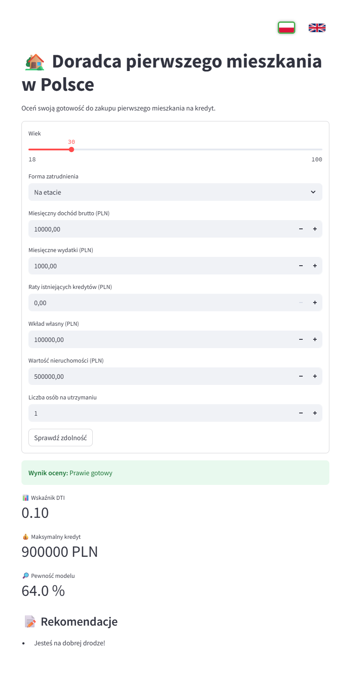

# FirstHome Advisor

**FirstHome Advisor** is a bilingual web application designed to help young adults in Poland assess their financial readiness to purchase their first home with a mortgage loan.

It combines user-friendly input forms, key financial indicators like DTI, and a lightweight machine learning model to provide clear, educational feedback and personalized recommendations.



## Features

- Interactive financial input form
- Calculation of key metrics (e.g., Debt-to-Income Ratio, maximum loan)
- Mortgage readiness classification: `Ready`, `Almost Ready`, or `Not Ready`
- Personalized financial suggestions
- Language toggle (🇵🇱 / 🇬🇧) with instant UI update
- Clean and minimal frontend using Streamlit

---

## Tech Stack

- **Python 3.11**
- **Streamlit** – frontend UI
- **scikit-learn** – Random Forest classifier
- **pandas** – data handling
- **pydantic** – input data validation

---

## Getting Started

### 1. Install dependencies

Using `poetry`:

```bash
poetry install
```

### 2. Run the app

From the root directory:

```bash
streamlit run src/frontend/ui.py
```
